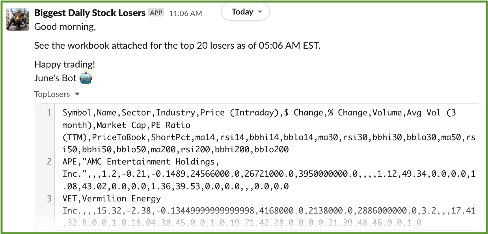

  

# Top Daily Stock Losers & Trading Opportunities

> **⚠ NOTE: The main.py script requires your own SlackApp OAuth token and Slack channel ID for this script to work.**  
> * Info on creating a token can be found **[here](https://slack.com/help/articles/215770388-Create-and-regenerate-API-tokens)** and you can find your Slack channel ID per the instructions in **[this link](https://help.socialintents.com/article/148-how-to-find-your-slack-team-id-and-slack-channel-id)**.
> * You can submit a request **[here](https://vis-x.slack.com/archives/C04H59LAASJ)** to join my Slack workspace and receive my bot's messages. 

This algorithm grabs the **[top losers from YahooFinance!](https://finance.yahoo.com/losers)** and scrapes their trailing 1-year stock price history using the **[yfinance API](https://pypi.org/project/yfinance/)** to calculate several technical trading and fundamental valuation indicators and runs 3 times each trading day according to a schedule based on the EST timezone:

#### **Technical**:
* Bollinger Bands ("BB")
* Relative Strength Indicator ("RSI")

#### **Fundamental**:
* Price-to-Earnings ("P/E") Ratio
* Price-to-Book ("P/B") Ratio

#### **Daily Scheduled Runs**:
* 10:00 AM EST
* 12:00 PM EST
* 3:30 PM EST

## Methodology
Several time intervals are considered when calculating the technical indicators:
* **Short-term**:
  * 14-day
  * 30-day
* **Mid-term**:
  * 50-day
* **Long-term**:
  * 200-day

The algorithm suggests buying opportunities for stocks meeting these criteria:

#### **Technical**:
* **BB**: Falls below lower-bound of the BBs
* **RSI**: Falls below 30

#### **Fundamental**:
* **P/E Ratio & P/B Ratio**: Lower than S&P500

## CI/CD Pipeline
### CircleCI
This algo uses CircleCI servers to run the above analysis.

### Slack integration
I created a Slack App to send out these daily updates in my **[VisX Slack workspace](https://vis-x.slack.com)** using a Slack OAuth token referenced in a **[Slack WebClient class](https://slack.dev/python-slack-sdk/web/index.html)** in my main python script. Here's a screenshot of how this message looks:

  

### Other Branches
The e-mail branch follows the same approach above except it sends out e-mails instead of Slack messages. 

## Future Product Increments
* Slack App will send a PDF with a more clean and detailed report.